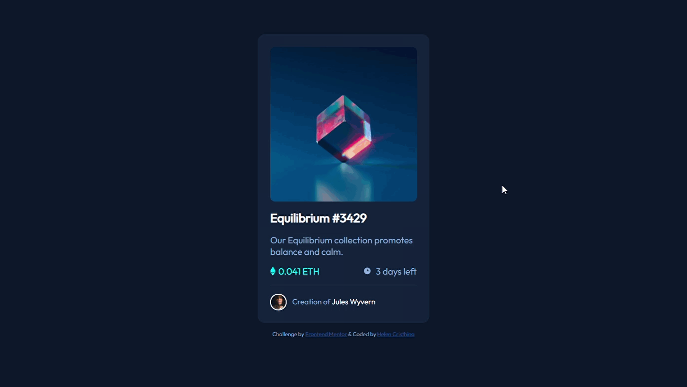

# Frontend Mentor - NFT preview card component solution

This is a solution to the [NFT preview card component challenge on Frontend Mentor](https://www.frontendmentor.io/challenges/nft-preview-card-component-SbdUL_w0U). Frontend Mentor challenges help you improve your coding skills by building realistic projects. 

  <a href="https://github.com/hcristha/nft-preview-card-component-main#the-challenge">The challenge</a> •
  <a href="https://github.com/hcristha/nft-preview-card-component-main#built-with">Built with</a> •
  <a href="https://github.com/hcristha/nft-preview-card-component-main#author">Author</a>

## <!-- linha -->

  

## <!-- linha -->

<h3 id="the-challenge">The challenge</h3>
Users should be able to:

- View the optimal layout depending on their device's screen size
- See hover states for interactive elements

## <!-- linha -->

<h3 id="built-with">Built with</h3>

- Semantic HTML5 markup
- CSS
- Mobile-first workflow

## <!-- linha -->

<h3 id="author">Author</h3>

- Made with ❤ by Helen Cristhina A. 👋 [See my linkedin](https://www.linkedin.com/in/hcristha/)
- Frontend Mentor - [@hcristha](https://www.frontendmentor.io/profile/hcristha)

  

